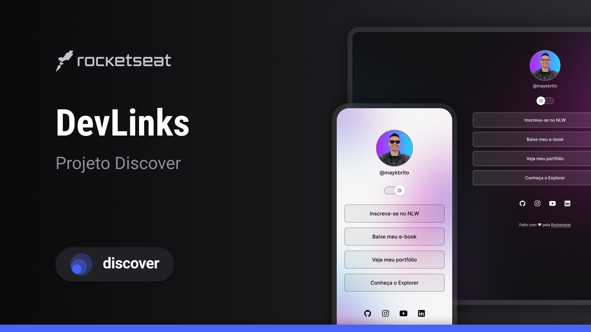

<h1 align="center"> LinkTree Switched </h1>

Projeto feito durante o curso promovido pela Rocketseat para ensino de tecnologias WEB.

  <a href="#-tecnologias">Tecnologias</a>&nbsp;&nbsp;&nbsp;|&nbsp;&nbsp;&nbsp;
  <a href="#-projeto">Projeto</a>&nbsp;&nbsp;&nbsp;|&nbsp;&nbsp;&nbsp;
  <a href="#-layout">Layout</a>&nbsp;&nbsp;&nbsp;|&nbsp;&nbsp;&nbsp;
  <a href="#memo-licença">Licença</a>

  

 

  

## 🚀 Tecnologias

Esse projeto foi desenvolvido com as seguintes tecnologias:

- HTML e CSS
- JavaScript
- Git e Github
- Figma

## 💻 Projeto

O LinkTree Switched é um agregador dinâmico de links para usar como cartão de visitas. Ele troca do modo dark para o modo light, dando uma idéia de dinamismo para o usuário final.

## 🔖 Layout

Espaço para colocar o Link do projeto no Figma (Anexar depois)

## :memo: Licença

Esse projeto está sob a licença MIT.

---

Feito com ♥ by Jaxy :wave:
